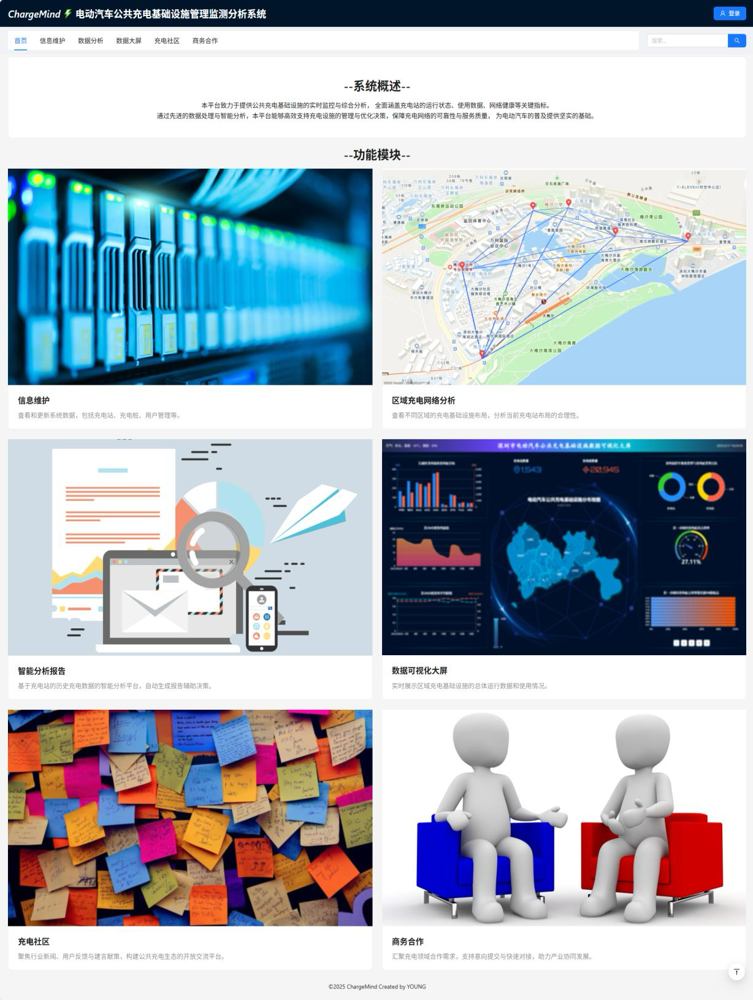
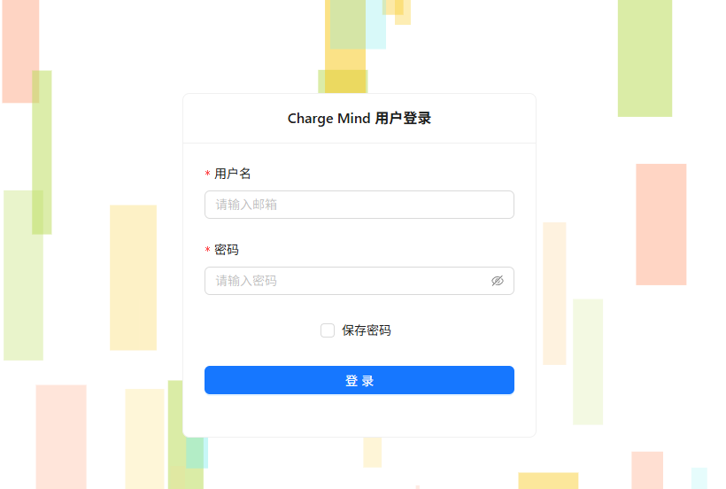
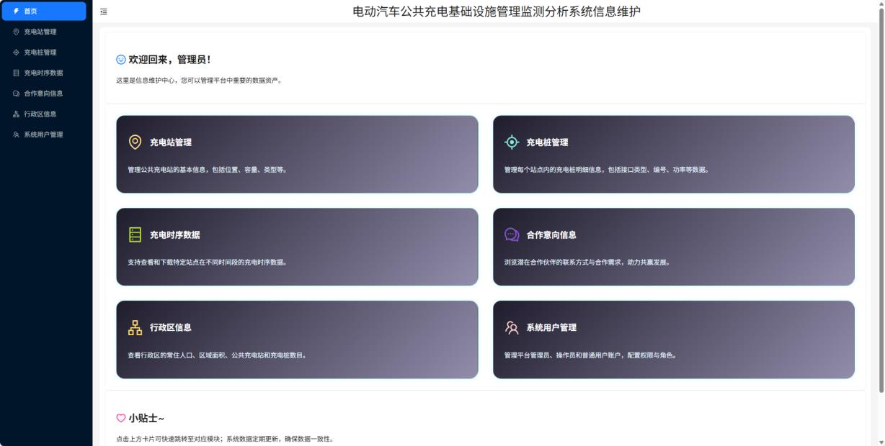
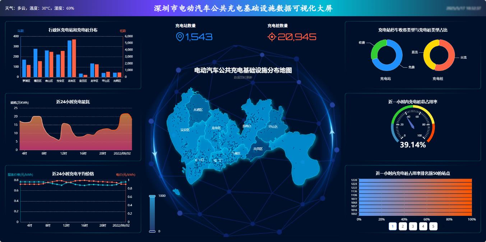
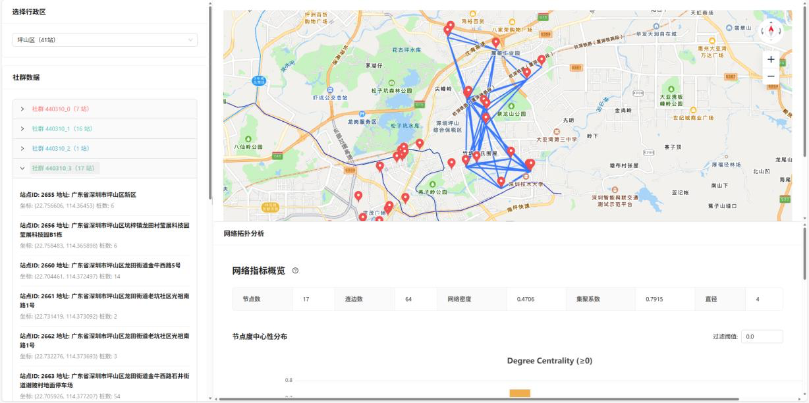
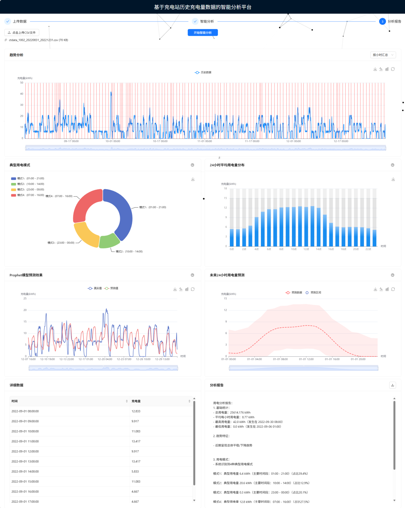
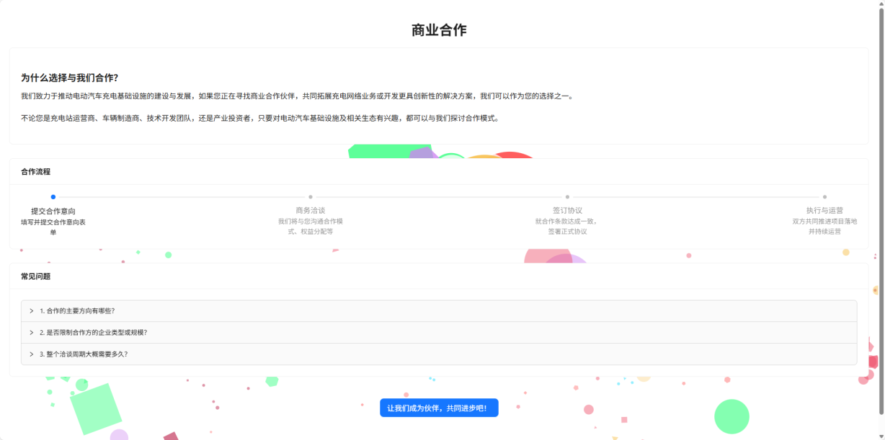
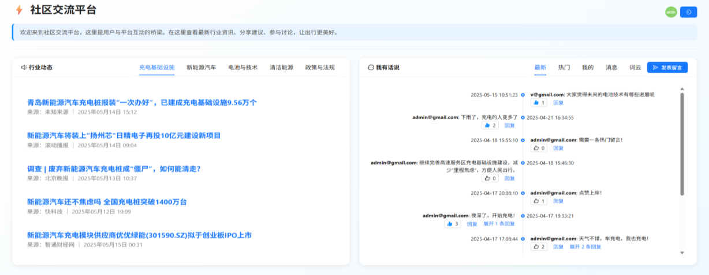

# EV Charging Operations Console

[](https://github.com/TriggerYoung/ev-station-platform-demo)

> **在线 Demo 部署中。** 取得可长期访问的正式地址后，将在此处添加体验按钮。

全栈演示项目：**充电站与桩的台账管理**、**运行态时序指标可视化**、**地图与网络视图**、**上传数据的统计与预测**、**反馈与社区模块**。前后端按业务域拆分，便于阅读代码结构。

**维护者：** [@TriggerYoung](https://github.com/TriggerYoung)

---

## 在线演示

在线版本以 **Demo 模式**运行：前端使用内置模拟数据完成核心页面与交互展示，不连接公开数据库，也不会将访客操作写入真实业务环境。

- 打开 `/login`，点击“**一键访客体验**”即可进入数据大屏；带有 `redirect` 参数时会进入原目标页面。
- 进入“分析报告”后点击“**加载演示样例**”，即可直接完成趋势、聚类、预测与报告生成，无需自行准备 CSV。
- 页面会显示“演示模式 · 模拟数据”标识，避免将模拟数据误认为真实运营数据。
- 演示数据以仓库 `backend/network_data` 中的 1,543 个站点快照为基础，在前端确定性派生充电桩、运行指标与趋势数据；同一版本每次打开得到一致结果。
- 可使用 `?demo=1` 强制开启 Demo 模式，使用 `?demo=0` 切换到真实后端模式；选择会保存在当前浏览器中。
- 生产构建未显式配置时默认开启 Demo 模式；本地开发未显式配置时默认连接 Flask 后端。

> 在线 Demo 用于稳定展示交互与前端工程能力；完整的 Flask、MySQL 与 InfluxDB 实现均保留在本仓库中。

---

## 逻辑说明

- **数据分层**：关系型数据承载站点、桩、用户等主数据；时序数据承载电量、占用率、价格等观测，查询与展示路径分离。
- **接口形态**：后端按模块划分 REST 入口；前端路由与模块一一对应，页面内聚合图表与地图能力。
- **分析链路**：对上传的时间序列做重采样与统计，在预测环节优先使用 Prophet，环境不满足时回退到轻量统计模型，保证接口形态稳定。

---

## 技术概要

前端以 React 为主，配合常用图表与地图组件；后端为 Flask，连接 MySQL 与 InfluxDB 2.x；分析侧使用 pandas、scikit-learn、statsmodels 等。

---

## 运行方式

### 方式一：本地 Demo 模式（无需数据库）

适合快速查看项目。前端会使用内置模拟数据，不需要启动 Flask、MySQL 或 InfluxDB。

```bash
cd evpcs_monitor/frontend
npm ci
REACT_APP_DEMO_MODE=true npm start
```

浏览器访问 <http://localhost:3000/login>，点击“一键访客体验”。也可以在任意页面 URL 后增加 `?demo=1` 临时切换。

### 方式二：连接真实本地后端

真实后端模式需要 Python 3、MySQL 以及 InfluxDB 2.x。先准备后端环境：

```bash
cd evpcs_monitor/backend
python3 -m venv .venv
source .venv/bin/activate
pip install -r requirements.txt
cp .env.example .env
```

编辑 `.env`，填写本机 MySQL 连接信息和仅供本地使用的 `DEMO_USER_PASSWORD`。随后先校验、再幂等写入演示主数据：

```bash
python3 seed_demo_data.py --dry-run
python3 seed_demo_data.py
```

该脚本以仓库 `network_data` 为事实源，创建缺失数据库与表，并写入 9 个行政区、1,543 个站点、20,945 个确定性生成的充电桩以及演示用户和评论；重复运行不会新增重复记录，也不会执行 `DROP` 或 `TRUNCATE`。旧版 `mysql_scripts/build_sql.sql` 仍保留作结构参考，但不再作为推荐初始化入口。

数据大屏中的时序指标在真实后端模式下仍需要单独准备 InfluxDB 数据；在线 Demo 则使用确定性生成的时序数据。服务与数据就绪后，检查连接并启动 Flask：

```bash
python check_env.py
python app.py
```

另开一个终端启动前端：

```bash
cd evpcs_monitor/frontend
npm ci
REACT_APP_DEMO_MODE=false npm start
```

开发服务器会把 `/api` 请求代理至 `http://127.0.0.1:5000`。不要把 `.env`、数据库密码或 InfluxDB Token 提交到 Git。

### 部署到腾讯云 CloudBase 静态网站托管

当前仓库是 React 单页应用，线上 Demo 使用内置模拟数据，托管静态构建产物即可。腾讯云控制台中进入「云开发 CloudBase → 静态网站托管 → 新建部署 → Git 仓库 → 公开仓库」，填写本仓库地址 `https://github.com/TriggerYoung/ev-station-platform-demo.git`，分支选择 `main`。构建配置如下：

| 配置项 | 值 |
| --- | --- |
| 项目框架 | React |
| 目标目录 | `./evpcs_monitor/frontend` |
| Node.js 版本 | 20 或 22 |
| 安装命令 | `npm ci` |
| 构建命令 | `npm run build:cloudbase` |
| 构建产物目录 | `./build` |
| 部署路径 | `/` |
| 环境变量 | `REACT_APP_DEMO_MODE=true` |

部署后，在「静态网站托管 → 基础配置」将 4xx 错误页面设为 `index.html`，让 `/login`、`/data_panel` 等 React Router 子页面可直接访问和刷新。先用默认域名验证首页、访客登录和子页面；默认域名仅适合测试，面向面试官的长期访问入口需要绑定自有域名。使用中国大陆资源提供网站服务时，自有域名需完成 ICP 备案。取得稳定生产地址后，再将 README 顶部的 Demo 按钮指向该地址。具体操作见腾讯云的[部署指南](https://docs.cloudbase.net/hosting/web-hosting-guide)、[React 单页应用指南](https://docs.cloudbase.net/recipes/add-hosting-react)与[默认域名限制](https://docs.cloudbase.net/service/alias)。

> 此项目目前有历史 ESLint 告警。CloudBase 设置 `CI=true` 时，Create React App 会将告警视为构建错误；`build:cloudbase` 脚本只在 CloudBase 构建过程中将其恢复为告警，不表示告警已修复。CloudBase 的构建命令栏不接受行内赋值，且其环境变量配置未覆盖构建进程中的 `CI=true`。标准 `npm run build` 仍保持原样；后续应逐项处理告警并重新启用严格构建。

### 部署到 Vercel（备选）

仓库根目录的 [`vercel.json`](vercel.json) 已包含 monorepo 构建路径和 React Router 的 SPA 回退配置。Vercel 只部署可公开访问的 Demo 前端，不部署 Flask、MySQL 或 InfluxDB。

[Deploy with Vercel](https://vercel.com/new/clone?repository-url=https%3A%2F%2Fgithub.com%2FTriggerYoung%2Fev-station-platform-demo)

1. 在 Vercel 导入本 GitHub 仓库，**Root Directory 保持仓库根目录**。
2. 构建设置直接使用 `vercel.json`；如需显式配置环境变量，可增加 `REACT_APP_DEMO_MODE=true`。
3. 完成 Production 部署后，将 README 顶部的 Demo 按钮指向实际 URL。

---

## 页面展示

### 落地页

项目入口与总览，串联各功能模块的导航与简要说明。



### 登录

身份与权限入口，区分不同角色对后台能力的访问范围。



### 信息维护

充电站、充电桩、用户与行政区等主数据的维护界面，支持检索、分页与批量类操作。



### 数据大屏

将电量、占用率、价格、排名等时序与聚合指标放在同一视图中，便于观察运行态势。



### 网络分析

结合地图与图结构，展示站点空间分布及社群 / 网络关系类可视化。



### 分析报告

上传带时间戳的用电（或同类）序列后，进行统计摘要、模式聚类与时序预测，并生成可读结论。



### 商务反馈

面向业务侧的留言与处理流：提交、列表浏览与状态标记。



### 社区

讨论区能力：列表、回复、点赞与热榜，以及基于文本的词云等展示。



---

本仓库同时提供稳定的浏览器 Demo 与完整全栈实现。在线环境使用模拟数据；真实后端模式所需的本地凭据和大体量时序数据不纳入 Git。
